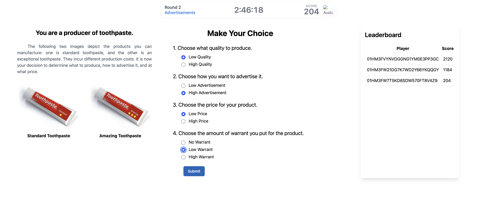
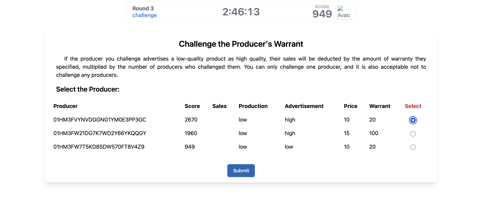
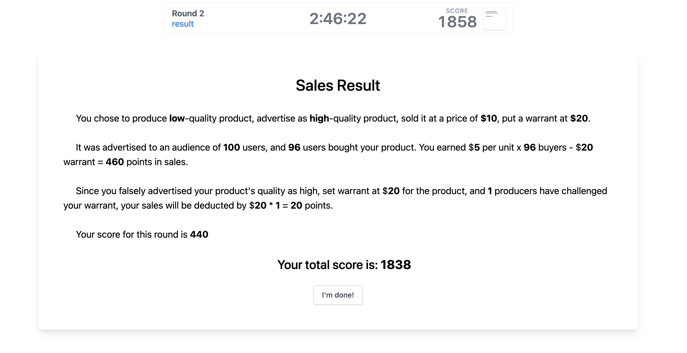
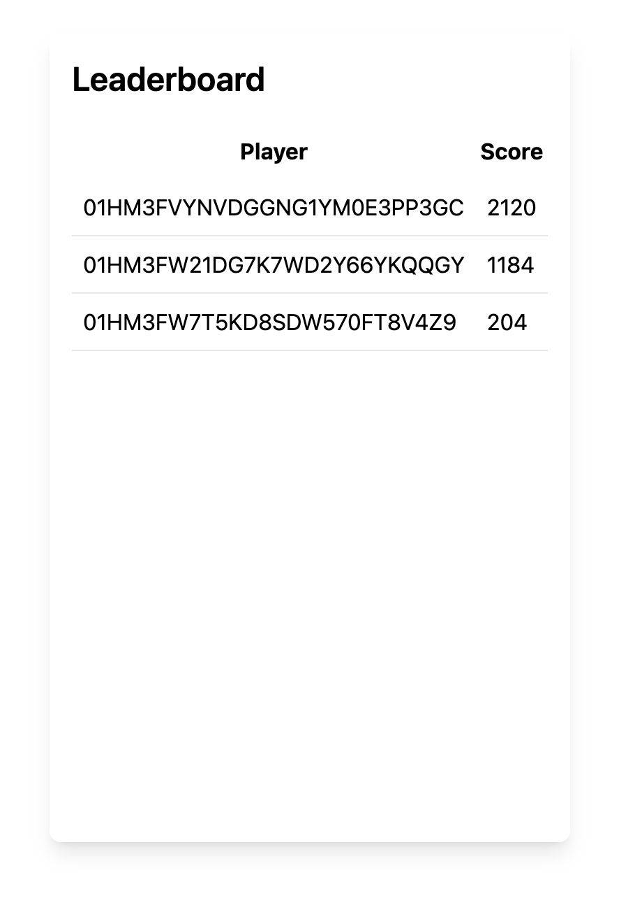

# Virtual Marketplace Experiment Readme

## Overview

Welcome to the Virtual Marketplace Experiment! Immerse yourself in a unique marketplace simulation where you play the roles of both **a producer and a consumer**.

As a producer, you have the freedom to explore various advertising options, including the intriguing choice of selling a sub-par product at a higher price through deceptive advertisements. On the flip side, consumers are presented with a selection of product advertisements, and they must make informed purchasing decisions.

This project is built on **Empirica**, an open-source virtual lab platform designed for developing and conducting synchronous and interactive human-participant experiments. Empirica offers an API that empowers experiment designers to focus on creating participant-facing views and experiment-specific logic. Visit the [empirica.ly](https://empirica.ly) website for more details.

The project predominantly utilizes **React** and **Tailwind CSS**.

## Implemented Feature - "Warrant"

1. **Introduction of "Warrant" Feature:** The recent update introduces a new feature called "Warrant."

2. **Empowered Producers:** Producers now have the ability to attach a warrant to their advertisements, committing a certain amount of money to assert the truthfulness of the advertisement for a wider audience. 

3. **Types of Warrants:** Producers can now choose from "No Warrant," "Low Warrant," or "High Warrant" for their products.

4. **Challenging System:** 

    - **Interactive Challenges:** Competitors and other players can challenge the warrant if they suspect the claims in the ad are false. The challenge resolution is currently based on whether the production choice (quality) aligns with the advertising choice (quality).

    - **Number of Challenges** Producers can challenge **only one** producer each time.

    - **Deductions System:** If a producer is found to have falsely advertised a product, deductions will be **the number of challenges multiplied by the amount of warrant**.

##  Questions about Warrant Feature

**1. Discuss how you would plan the feature including any designs, references, links to resources you’ve used to determine the best way to develop such a feature.**

The introduction of the "Warrant" feature in the Virtual Marketplace Experiment adds a layer of complexity to the producer-consumer dynamic, allowing producers to assert the truthfulness of their advertisements and consumers to make informed decisions. In this essay, we will discuss the planning and design considerations for implementing this feature, considering the empowerment of producers, the types of warrants available, and the challenging system.

**Empowered Producers:**
Producers are now empowered with the ability to attach a warrant to their advertisements. This commitment involves a certain amount of money and aims to ensure the truthfulness of the advertisement for a wider audience. To plan this feature, it's crucial to define the parameters of empowerment, ensuring that producers have the flexibility to make meaningful choices regarding the warrant amount.

Designing a user-friendly interface for producers to seamlessly incorporate the warrant into their advertising process is essential. This involves creating a clear and intuitive flow within the advertisement stage where producers can set the warrant amount and choose the type of warrant they want to associate with their product.

**Types of Warrants:**
Producers can now choose from "No Warrant," "Low Warrant," or "High Warrant" for their products. To plan this aspect, it's important to consider the implications of each warrant type on both producers and consumers. "No Warrant" might attract more consumers initially, but it comes with the risk of facing challenges without any financial commitment.

The design should reflect the balance between attracting consumers and mitigating risks. Clear tooltips or information panels can guide producers in understanding the potential impact of each warrant type on their overall performance.

**Challenging System:**
The challenging system is a pivotal component of the "Warrant" feature, allowing interactive challenges from competitors and other players. The resolution of challenges is based on the alignment between the production and advertising choices. Planning this system involves creating a fair and transparent process for challenges and resolutions.

Designing an intuitive interface for players to submit challenges during the challenge stage is crucial. Clear guidelines on the criteria for a valid challenge, such as discrepancies between advertised and actual product quality, should be communicated to ensure a fair gameplay experience.

**Post-Challenge Assessment:**
After selecting a producer to challenge, players enter the post-challenge assessment stage. Designing this stage involves providing a platform for players to submit their challenges, accompanied by any evidence or reasoning. A user-friendly interface with options for uploading relevant information enhances the transparency of the challenge process.

**Score Computation:**
Scores are computed based on various factors, including product price, production cost, warrant, and deductions from challenges. The design should include a robust scoring algorithm that accurately reflects the impact of each factor on the overall score. Clear visualization of scores in the result stage helps participants understand the outcomes of their decisions.

**2. Discuss why this feature is reflective of a real-world marketplace and what kind of trade-offs you would want to consider to make this feature easy for users to employ.**

**Reflecting Real-world Marketplace Dynamics:**

1. **Consumer Trust and Accountability:**
   In the real-world marketplace, consumer trust is paramount. Producers are accountable for the claims they make about their products, and consumers rely on these claims to make informed decisions. The introduction of the "Warrant" feature brings a sense of accountability to virtual producers, mimicking the real-world scenario where companies often make commitments to ensure the authenticity of their products.

2. **Risk and Incentives:**
   The feature's inclusion of different types of warrants, such as "No Warrant," "Low Warrant," or "High Warrant," mirrors the real-world trade-offs that producers face. Companies often weigh the risks and benefits of making explicit commitments to their products. While a high warrant may attract more customers, it also exposes the producer to higher risks in case of challenges. This dynamic closely resembles the strategic decisions companies make in the competitive marketplace.

3. **Competitive Challenges:**
   The challenging system adds an element of competition to the virtual marketplace, reflecting the reality of competitors monitoring and challenging each other's claims. In the real world, companies may face scrutiny from rivals or consumer advocacy groups, necessitating a transparent and accountable advertising process. The interactive challenge system in the Virtual Marketplace Experiment simulates this competitive environment, providing participants with a holistic understanding of marketplace dynamics.

**Trade-offs for User-Friendly Implementation:**

1. **Complexity vs. Accessibility:**
   A key trade-off in implementing the "Warrant" feature is balancing complexity with accessibility. While the feature aims to replicate real-world complexities, it is crucial to ensure that users, including those less familiar with marketplace intricacies, can easily navigate and understand the system. Designing clear and concise tooltips, guidance, and informational pop-ups can help users make informed decisions without feeling overwhelmed.

2. **Flexibility vs. Simplicity:**
   Offering producers the flexibility to choose from different types of warrants introduces a level of sophistication to the simulation. However, striking the right balance between flexibility and simplicity is essential. The interface should guide producers through the decision-making process, providing them with relevant information about the potential consequences of each warrant type without creating confusion.

3. **Engagement vs. Overwhelm:**
   The challenge system, while adding engagement to the simulation, must be carefully implemented to avoid overwhelming users. Limiting the number of challenges to one per producer per round is a strategic trade-off. It reflects the real-world scenario where reporting a company for false advertising involves a significant commitment of time and effort. This limitation ensures engagement without burdening users with excessive challenges.

## Bonus Features

### 1. UI Reorganization
- **Streamlined Layout:** The UI has undergone a revamp for a simplified layout on the 'Advertisements.jsx' page.

- **Enhanced Display:** The layout features two product images with captions, main questions for producers, and a leaderboard on the right-hand side.

### 2. Leaderboard
- **Performance Snapshot:** A leaderboard is now accessible, showcasing the top and bottom producers based on their earnings in the marketplace.
- **Round Insights:** Producers can check the leaderboard in each round to gauge how the market is performing.

### 3. Result Page
- **Post-Challenge Assessment:** After selecting a producer to challenge, players can submit and view the result page.
- **Score Computation:** Scores are calculated based on product price, production cost, warrant, and deductions from challenges.

## Factors

- **Player Count:** The variable `playerCount` determines the number of players in a game.
- **Number of Rounds:** The variable `numRounds` determines the number of rounds a game has.
- **Chat Enablement:** The variable `chatEnabled` determines whether the chat box is enabled.

## How to Use

1. **Clone the Project:** Clone the project from the provided GitHub repository.
2. **Navigate to Project Directory:** Use the terminal and navigate to the project directory.
3. **Launch Empirica:** Enter `empirica` in the terminal and hit the return button.
4. **Access Admin Page:** Visit `localhost:3000/admin` in your browser.
5. **Explore Factors:** Explore the Factors page and Treatments page.
6. **Start Experiment:** Click on "New Batch" to initiate a new experiment.

